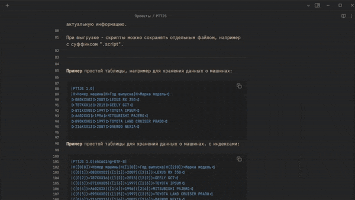

<p align="right">
  <a href="README.ru.md">🇷🇺 Русский</a> |
  <a href="README.md">🇬🇧 English</a>
</p>

# Obsidian PTTJS Viewer

A plugin that renders PTTJS (Plain Text Table JavaScript) tables inside [Obsidian](https://obsidian.md).

## Usage



Create a code block with the language set to `pttjs`, then paste your PTTJS data inside it:

````markdown
```pttjs
|PTTJS 1.0|encoding=UTF-8|
|H>Name|H>Age|H>Profession<|
|>Ivan|>30|>Programmer<|
|>Maria|>28|>Designer<|
|>Alexey|>35|>Manager<|
```
````

The plugin will automatically render the table in preview mode.

## Manual Installation

### From this repository

1. Clone the repository into your vault’s `.obsidian/plugins/pttjs-viewer` folder.
2. Install dependencies:

   ```bash
   npm install
   ```

3. Build the plugin:

   ```bash
   npm run build
   ```

4. Restart Obsidian.
5. Enable **Obsidian PTTJS Viewer** in _Settings → Community Plugins_.

## Development

- `npm run dev` – start the development watcher with automatic rebuilds.
- `npm run build` – build an optimized production version.
- `npm version patch` – bump the patch version.

## License

Released under the [MIT License](LICENSE).
